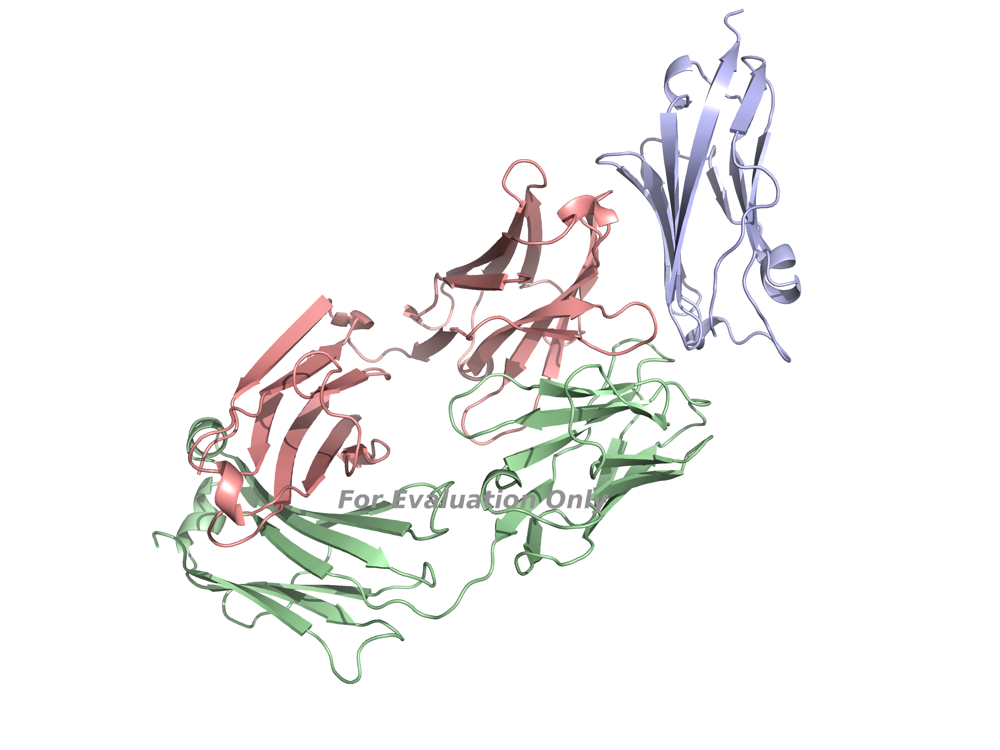

# Antibody–Antigen Complex Prediction with Boltz-2

Prediction and evaluation of PD-L1–atezolizumab complexes using Boltz-2. CDRH3 variants generated by ESM3 were validated through structural confidence metrics and interface quality analysis.

## Workflow

| Step | Method | Output |
|--------|--------|--------|
| 1 | Extract sequences from PDB 5X8L | PD-L1, HC, LC |
| 2 | ESM3 sequence generation | Novel CDRH3 variants |
| 3 | Boltz-2 structure prediction | Antibody–antigen complexes |
| 4 | Confidence analysis | ipTM, pTM, pLDDT |
| 5 | Candidate ranking | Top redesigned variants |

## Wild-Type Complex Prediction

PD-L1 and atezolizumab heavy/light chains were extracted from PDB 5X8L and used as input for Boltz-2.

## Prediction Results

| Model | CDRH3 | Confidence Score | ipTM |
|---------|---------|---------:|---------:|
| WT | RHWPGGFDY | 0.930 | 0.827 |
| Variant 1 | GDGYGYFDY | 0.915 | 0.796 |
| Variant 2 | GGYYYSMDY | 0.912 | 0.802 |
| Variant 3 | GGYYYGFDY | 0.928 | 0.813 |

Variant 3 retained 98.3% of the wild-type interface confidence while introducing substantial sequence diversity within the CDRH3 loop.

## Top Variant

CDRH3:
GGYYYGFDY

Boltz-2 metrics:

- Confidence Score: 0.928
- pTM: 0.841
- ipTM: 0.813
- Complex pLDDT: 0.957

This variant maintained interface confidence comparable to the therapeutic parent antibody while introducing a redesigned CDRH3 sequence.

## Key Takeaways

- Generated novel antibody CDRH3 sequences using ESM3
- Predicted antibody–antigen complexes using Boltz-2
- Evaluated interface quality through ipTM and pLDDT metrics
- Identified a redesigned CDRH3 variant that retained 98% of wild-type interface confidence
